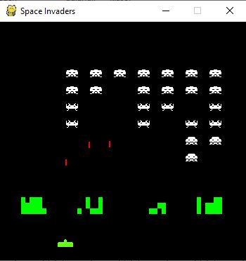

# Space Invaders

Space Invaders is an old arcade game from 1980s. In this project I tried to simulate that game.

Inefficiencies:

- I used a one-dimensinol list to hold enemy invaders and it cost me unnecessarily much lines of code to detect an invader in a particular line. This should be recoded.

- I didn't make a replay function, after you died you need to rerun the script.

- There is a bit problem with sounds. I was too lazy to make them work more decently.

- I didn't spent much time to clean the code. There might be a little bit mess.

